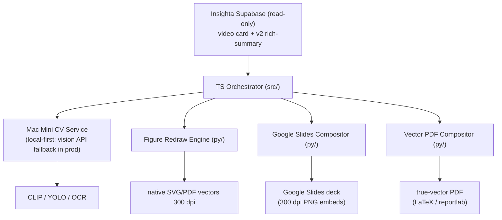

# insighta-slidegen

Convert an Insighta video card's v2 rich-summary into a Google Slides deck and a true-vector PDF — figures are redrawn as native vector graphics at 300 dpi, not screenshots.

> PUBLIC repo — essentials only (code, schema, IaC, contributor docs). No credentials, ops runbooks, user data, or prod metrics.

---

## Stack

| Layer | Technology |
|---|---|
| Orchestrator | TypeScript (Node 20, `src/`) |
| Slide compositor | Python `google-api-python-client` (`py/`) |
| Vector PDF compositor | Python `reportlab` / LaTeX (`py/`) |
| CV service (Mac Mini) | Python CLIP + YOLO + OCR (`mac-mini/slidegen-service/`) |
| Data source | Insighta Supabase (read-only) |
| Data sink | Slide metadata in Supabase `slide_*` tables (raw SQL DDL — no `prisma db push`) |
| Slide output | Google Slides (300 dpi PNG embeds) |
| PDF output | Track 1: Slides export (raster); Track 2: true-vector via LaTeX/reportlab |
| ORM | Prisma (`@prisma/client`) |

---

## Architecture



Pipeline is card-level v1: one card → one deck.

---

## Quick Start

> **New contributor?** Follow the step-by-step guide in
> [`docs/ONBOARDING.md`](./docs/ONBOARDING.md) — it covers clone → setup → working
> with Claude Code. You can even tell Claude Code: *"Read `docs/ONBOARDING.md` and set
> up the project."*

```bash
git clone https://github.com/JK42JJ/insighta-slidegen.git
cd insighta-slidegen

npm install

cp .env.example .env
# Fill in DATABASE_URL, DIRECT_URL, SUPABASE_*, SLIDEGEN_CV_SERVICE_URL,
# GOOGLE_OAUTH_* — see .env.example for all keys and comments.
```

### Google OAuth setup

1. Create a project in [Google Cloud Console](https://console.cloud.google.com/).
2. Enable the **Google Slides API** and **Google Drive API**.
3. Create an OAuth 2.0 client (Desktop app type).
4. Download credentials and run the auth flow once to obtain a refresh token.
5. Set `GOOGLE_OAUTH_CLIENT_ID`, `GOOGLE_OAUTH_CLIENT_SECRET`, `GOOGLE_OAUTH_REFRESH_TOKEN` in `.env`.

### Run

```bash
# Dev (ts-node watch)
npm run dev

# Build
npm run build

# CLI
npm run slidegen -- --card-id <card-id>

# Tests
npm test
```

---

## Project Structure

```
insighta-slidegen/
├── src/                    # TypeScript orchestrator
│   ├── cli/                # CLI entry point
│   ├── pipeline/           # Card → slides orchestration
│   ├── adapters/           # Supabase read / slide_* write
│   └── config/             # Zod-validated env config
├── py/                     # Python: Slides compositor + vector PDF
│   ├── compositor/         # google-api-python-client slide builder
│   ├── vector_pdf/         # LaTeX / reportlab PDF track
│   └── tests/
├── mac-mini/
│   └── slidegen-service/   # CV service: CLIP + YOLO + OCR
│       ├── Dockerfile
│       └── tests/
├── prisma/
│   └── schema.prisma       # Prisma schema (slide_* tables via raw SQL DDL)
├── tests/                  # Vitest unit tests
├── .env.example            # Key names only — copy to .env, fill values
└── .github/workflows/
    ├── ci.yml              # PR CI: typecheck, lint, test, python, build
    └── deploy.yml          # GHCR image publish (manual / version tags)
```

---

## Conventions

This project inherits Insighta coding conventions. See `CLAUDE.md` in the parent repo for the full rule set. Key points:

- `strict: true` TypeScript end-to-end — no `strictNullChecks: false` sub-configs.
- DB changes via raw SQL DDL only (no `prisma db push` to Supabase prod — silent-fail risk).
- No magic numbers — use named constants.
- No `@/` path imports going 3+ levels deep — use `@/` alias from `src/`.
- New function/hook/route → minimum one unit test.

---

> PUBLIC repo — essentials only. No credentials, no ops runbooks, no user data, no prod metrics are committed here.
