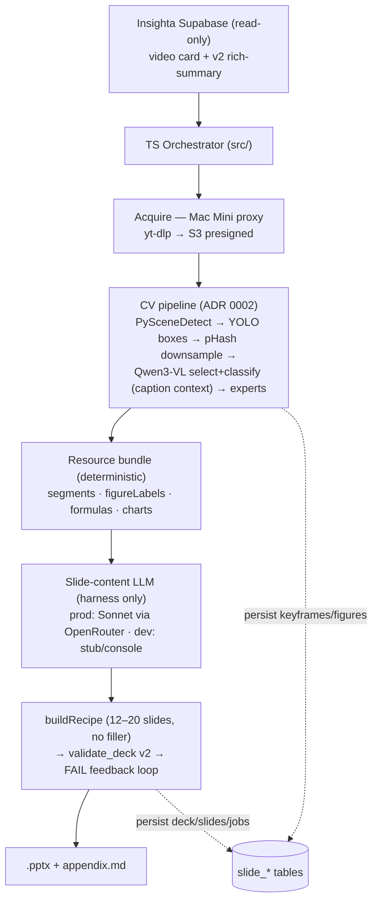

# insighta-slidegen

> **🔀 Scope pivot (2026-06-15): single-video → deck is now an intermediate.** The
> project's output unit moved to **mandala (video-collection) → one deck**. The v1
> single-video design below is retained for history/reuse (per-video CV stages
> still apply). Consolidated archive:
> [`docs/archive/v1-single-video-per-deck.md`](docs/archive/v1-single-video-per-deck.md).

Convert an Insighta video card's v2 rich-summary into a typed **.pptx deck** — figures are **regenerated from extracted data** (native editable objects + ≥300 dpi data graphs), never pasted raw frames. See [ADR 0003](./docs/adr/0003-mvp-pptx-output-and-prod-llm-extraction.md) (output/synthesis) and [ADR 0002](./docs/adr/0002-pipeline-v3-cpu-downsample-caption-context.md) (CV pipeline). A Google Slides + true-vector-PDF output is a deferred additive track.

> PUBLIC repo — essentials only (code, schema, IaC, contributor docs). No credentials, ops runbooks, user data, or prod metrics.

---

## Stack

| Layer | Technology |
|---|---|
| Orchestrator | TypeScript (Node 20, `src/`) |
| Deck builder | pptxgenjs template/recipe chain (`deck/`, vendored `insighta-visual-deck` — lands per ADR 0003 D7) |
| Deck validator + teaching graphs | Python `validate_deck.py` / `figures.py` (matplotlib, `py/`) |
| CV pipeline (per ADR 0002) | PySceneDetect → DocLayout-YOLO (boxes) → pHash downsample → Qwen3-VL select+classify → experts (`mac-mini/slidegen-service/`) |
| Model serving | prod: cloud GPU host (Qwen3-VL-8B + DocLayout-YOLO); dev: local Mac Mini, same API surface (URL-only switch) |
| Acquire (video download) | Mac Mini residential-egress proxy → S3 presigned (ADR 0003 D4 — never from datacenter IPs) |
| Slide-content LLM | prod service path only: Claude Sonnet via OpenRouter, injected into the deterministic harness (ADR 0003 D2); dev/test: stubs / CC-console fixtures |
| Data source | Insighta Supabase (read-only) |
| Data sink | Slide metadata in Supabase `slide_*` tables (raw SQL DDL — no `prisma db push`) |
| Deck output | `.pptx` + Markdown appendix (validated by `validate_deck.py` before leaving the pipeline) |
| Deferred track | Google Slides + true-vector PDF (`py/slides_build/` stubs retained) |
| ORM | Prisma (`@prisma/client`) |

---

## Architecture



Pipeline is card-level v1: one card → one deck. Figures are regenerated from
extracted data (struct-JSON / LaTeX / OCR), never pasted raw frames (ADR 0003 P2).

---

## Quick Start

> **New contributor?** Follow the step-by-step guide in
> [`docs/ONBOARDING.md`](./docs/ONBOARDING.md) — it covers clone → setup → working
> with Claude Code. You can even tell Claude Code: *"Read `docs/ONBOARDING.md` and set
> up the project."*

```bash
git clone https://github.com/JK42JJ/insighta-slidegen.git
cd insighta-slidegen

npm install

cp .env.example .env
# Fill in DATABASE_URL, DIRECT_URL, SUPABASE_*, SLIDEGEN_CV_SERVICE_URL,
# GOOGLE_OAUTH_* — see .env.example for all keys and comments.
```

### Google OAuth setup (deferred track only)

> Only needed for the deferred Google Slides output track — the `.pptx` MVP
> path (ADR 0003 D1) does not use Google APIs.

1. Create a project in [Google Cloud Console](https://console.cloud.google.com/).
2. Enable the **Google Slides API** and **Google Drive API**.
3. Create an OAuth 2.0 client (Desktop app type).
4. Download credentials and run the auth flow once to obtain a refresh token.
5. Set `GOOGLE_OAUTH_CLIENT_ID`, `GOOGLE_OAUTH_CLIENT_SECRET`, `GOOGLE_OAUTH_REFRESH_TOKEN` in `.env`.

### Run

```bash
# Dev (ts-node watch)
npm run dev

# Build
npm run build

# CLI
npm run slidegen -- --card-id <card-id>

# Tests
npm test
```

---

## Project Structure

```
insighta-slidegen/
├── src/                    # TypeScript orchestrator
│   ├── index.ts            # CLI entry point
│   ├── config/             # Zod-validated env config (central process.env funnel)
│   ├── resolve/            # card → youtube video id
│   ├── fetch/              # v2 rich-summary fetch + gate (v2/pass/transcript_used)
│   ├── cv/                 # CV service client (submit → poll → result)
│   ├── plan/               # deterministic slide planning helpers
│   ├── db/                 # slide_* repository (writes ONLY slide_* tables)
│   └── types/              # Zod schemas / inferred contracts
├── deck/                   # vendored insighta-visual-deck chain (pptxgenjs) — lands per ADR 0003 D7
├── py/                     # Python: deck validator + teaching graphs
│   ├── slides_build/       # deferred Google Slides / vector-PDF track (stubs)
│   └── tests/
├── mac-mini/
│   └── slidegen-service/   # CV service (ADR 0002) + acquire proxy (ADR 0003 D4)
│       ├── Dockerfile
│       └── tests/
├── prisma/
│   ├── schema.prisma       # Prisma schema (slide_* tables via raw SQL DDL)
│   └── migrations/         # raw SQL DDL (no `prisma db push`)
├── docs/adr/               # architecture decision records (0001 → 0002 → 0003)
├── tests/                  # Vitest unit tests
├── .env.example            # Key names only — copy to .env, fill values
└── .github/workflows/
    ├── ci.yml              # PR CI: typecheck, lint, test, python, build
    └── deploy.yml          # GHCR image publish (manual / version tags)
```

---

## Conventions

This project inherits Insighta coding conventions. See `CLAUDE.md` in the parent repo for the full rule set. Key points:

- `strict: true` TypeScript end-to-end — no `strictNullChecks: false` sub-configs.
- DB changes via raw SQL DDL only (no `prisma db push` to Supabase prod — silent-fail risk).
- No magic numbers — use named constants.
- No `@/` path imports going 3+ levels deep — use `@/` alias from `src/`.
- New function/hook/route → minimum one unit test.

---

> PUBLIC repo — essentials only. No credentials, no ops runbooks, no user data, no prod metrics are committed here.
