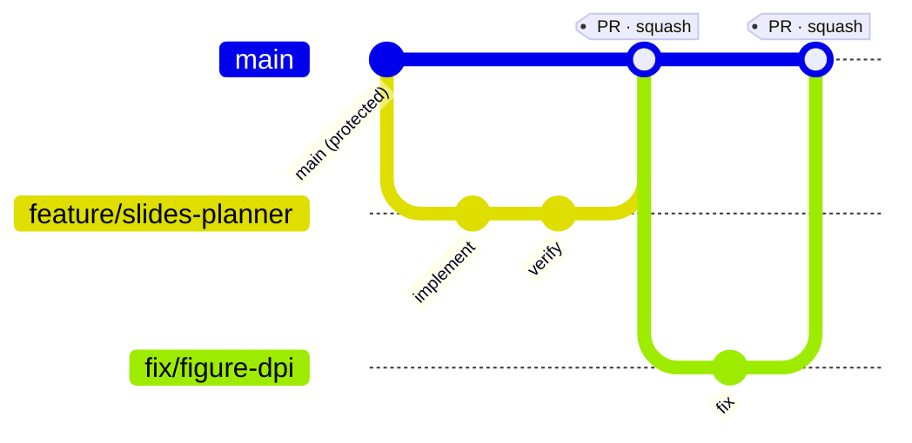
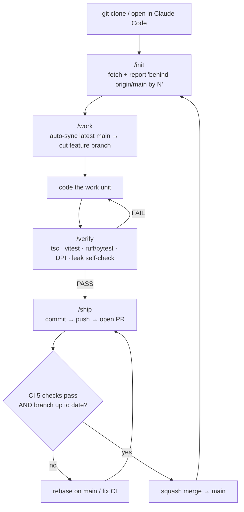
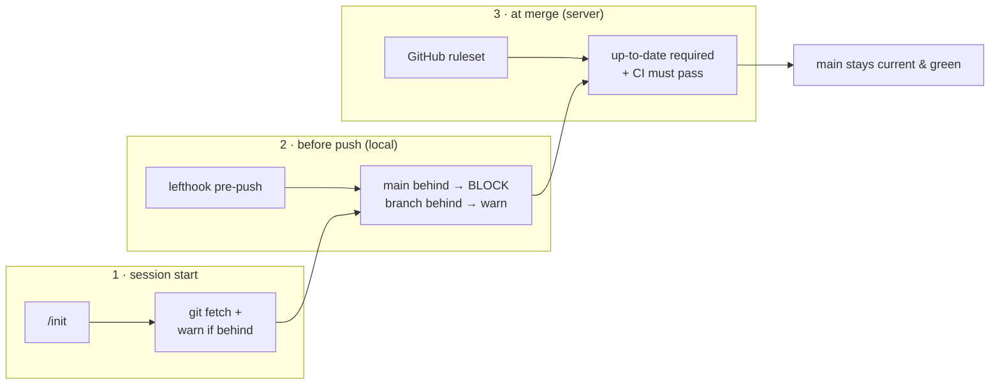

# Branching & Collaboration Strategy

How we keep `main` healthy and everyone's code current. Read this before your first PR.

**TL;DR** — `main` is protected: **no direct pushes**. Always branch off the latest
`main`, open a PR, let CI pass, and merge. Three guardrails keep you from working on
stale code.

---

## 1. Branch model



- **`main`** — always green, always deployable. **Protected**: PR-only, no force-push, no deletion.
- **feature/fix branches** — short-lived, cut from the latest `main`, one logical unit of work.
  - `feature/<short-name>` for new work · `fix/<short-name>` for bug fixes · `docs/<short-name>` for docs.
- Merge via **squash** (clean linear history). Branch auto-deletes after merge.

---

## 2. Daily cycle (collaborator)



Commands do the heavy lifting — you mostly run `/init → /work → /verify → /ship`.

---

## 3. Three stay-current guardrails

You never have to *remember* to pull — the tooling enforces it at three points:



| # | Where | Mechanism | Enforcement |
|---|-------|-----------|-------------|
| 1 | session start | `/init` → `git fetch` + "behind by N" notice | advisory |
| 2 | before push (local) | **lefthook** `pre-push` (installed via `npm install`) | blocks stale `main` push; warns stale branch |
| 3 | at merge (server) | **GitHub ruleset** on `main` | hard — can't merge stale or red PRs |

---

## 4. `main` protection rules (GitHub ruleset)

- ✅ **Pull request required** — no direct pushes to `main` (applies to everyone, incl. owner).
- ✅ **Up to date before merge** (strict) — branch must include the latest `main`.
- ✅ **CI must pass** — 5 checks: Type Check (TS) · Lint (ESLint) · Test (Vitest) · Python lint + test · Build (tsc).
- ✅ **No force-push, no branch deletion** on `main`.
- ⚙️ Required approvals: 0 (small team — author may self-merge once CI + up-to-date). Bump later if desired.

---

## 5. When you're behind / conflicted

```bash
# behind main on your feature branch → bring it up to date before the PR
git fetch origin
git rebase origin/main          # or: git merge origin/main

# local main is behind (after someone merged a PR)
git switch main
git pull --ff-only origin main
```

- `/work` does the "pull latest main" step for you automatically when your tree has no
  tracked changes (untracked local files are fine).
- Never force-push `main` (ruleset blocks it). Force-push only your own feature branch if needed.

---

## 6. First-time setup recap

```bash
git clone https://github.com/JK42JJ/insighta-slidegen.git
cd insighta-slidegen
npm install          # also installs the lefthook git hooks (via "prepare")
npm run prisma:generate
# → then /init in Claude Code
```

See [`ONBOARDING.md`](./ONBOARDING.md) for the full setup, and
[`COLLABORATOR_ACCESS.md`](./COLLABORATOR_ACCESS.md) for database access.
