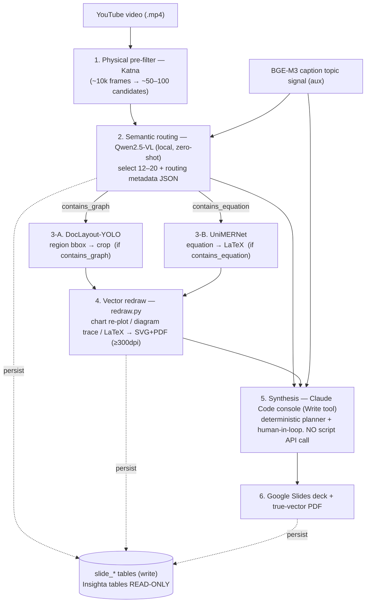

# ADR 0001 — Pipeline v1: VLM-routed frame selection + specialized extraction

> ⚠️ **SUPERSEDED by [ADR 0002 — Pipeline v3](./0002-pipeline-v3-cpu-downsample-caption-context.md) (2026-06-09).**
> This ADR is retained for historical context. The accepted current design replaces
> Katna→PySceneDetect (D1→0002 D1), keeps YOLO as boxes-only with Qwen as the kind
> authority (0002 D2), adds a CPU downsample before the VLM (0002 D3), merges
> selection+classification into one Qwen3-VL call with caption context (0002 D4/D5),
> carries time-provenance intervals (0002 D6), routes charts to Qwen3-VL (0002 D7),
> and revises infra to A100/RunPod (0002 D9). The LLM-API ban (D5), vector-300dpi
> gate (D6/D7), output contract, and `slide_*`-only writes are **carried forward**.

**Status**: Superseded by ADR 0002 (was: Accepted)
**Date**: 2026-06-01
**Supersedes**: the DRAFT frame-selection hypothesis in
`docs/architecture/slidegen-architecture.md` §1 (Katna → CLIP → BGE-M3 →
pgvector dedup → ~12) and resolves the open research in **Issue #1**.
**Scope**: v1 (training-free). LoRA fine-tuning is explicitly deferred to v2.

---

## 1. Context

The v0.1 architecture selected keyframes with a CLIP-embedding + BGE-M3 caption
dedup pipeline, marked **DRAFT pending research** (Issue #1). A revised
multimodal proposal was put forward:

> Katna → Qwen2.5-VL (semantic routing, LoRA) → conditional YOLO layout / math
> OCR → **Claude API** knowledge synthesis → **Marp / python-pptx** output,
> orchestrated by LangGraph, with LoRA trained on cloud A100s.

That proposal contains strong ideas (semantic routing, conditional extraction,
dedicated math OCR) but, as written, conflicts with several inherited
**Hard Rules** of this project. This ADR records the reconciled v1 design: the
good ideas kept, the rule conflicts resolved, and the rationale for each
decision so collaborators do not re-litigate them.

---

## 2. Decisions

### D1 — Semantic routing/selection uses a local VLM (Qwen2.5-VL), replacing CLIP
The CLIP-embedding selector is replaced by a **local vision-language model** that
reads the Katna candidate frames in timestamp order and (a) selects the
**12–20** knowledge-bearing slides and (b) emits per-frame routing metadata.

- **Model**: **Qwen2.5-VL-7B-Instruct**, 4-bit (MLX on Apple Silicon).
  - 3B is the memory fallback (see [D9](#d9--infra-local-first-on-apple-silicon-cloud-deferred)).
  - **Family rationale**: Qwen2.5-VL has the most mature tooling (MLX, vLLM, and
    MS-Swift / LLaMA-Factory) so the **v2 LoRA path stays in the same family** —
    no model swap between v1 and v2.
  - **Verify-at-build**: the knowledge cutoff is 2026-01. Before implementation,
    confirm whether a newer release (e.g. Qwen3-VL / InternVL3.5) has shipped and
    measurably beats Qwen2.5-VL on doc/chart/video; if so, swap within the family
    where possible.
  - **Alternative considered**: InternVL3-8B (often tops chart/OCR benchmarks),
    rejected for v1 only to preserve the LoRA continuity above.
- **Output (routing metadata, per selected frame)**:
  ```json
  {
    "slide_index": 3,
    "timestamp_sec": 255,
    "contains_graph": true,
    "contains_equation": false,
    "frame_type": "diagram",
    "summary_hint": "GraphDB architecture layout comparison"
  }
  ```
- **Training-free in v1**: zero-shot prompting only. No LoRA, no fine-tuning,
  no dataset generation (which would otherwise risk the LLM-API ban — see [D5](#d5--knowledge-synthesis-stays-in-the-claude-code-console-no-script-llm-api-call)).

### D2 — CLIP is dropped (not destructively)
- `typing_select.py` is rewritten around the VLM router; the CLIP encode +
  cosine-dedup path is removed.
- `figure_extract.py` no longer computes a CLIP embedding per figure.
- **DB**: `slide_keyframes.clip_embedding vector(512)` is **kept nullable and
  marked deprecated**, not dropped — destructive DDL is avoided per the
  `prisma db push` silent-fail Hard Rule and Cross-Layer-Propagation rule. A
  later ADR may remove it once no reader remains.

### D3 — Caption topic signal (BGE-M3) is retained as an auxiliary signal
`captions.py` (BGE-M3 topic-change detection over `video_captions`) stays. It
complements the visual router with a **text-derived topic boundary** signal and
feeds the console synthesis step. Only CLIP was replaced, not the caption path.

### D4 — Conditional specialized extraction (routed by D1 flags)
On the selected frames, run extractors **conditionally** on the routing flags:

- **D4-A — Layout / graph-region detection: DocLayout-YOLO** (replaces the
  generic `ultralytics` YOLOv8). YOLOv10-based, DocStructBench-trained, fast on
  CPU/MPS. Produces pixel-accurate bounding boxes for chart/table/figure regions
  to crop. *Fallback*: PP-DocLayout-L (RT-DETR; higher accuracy, heavier).
  - Division of labor: the VLM produces the `contains_graph` **flag**;
    DocLayout-YOLO produces the **bounding box** used for the crop. Both needed.
- **D4-B — Equation → LaTeX: UniMERNet** (replaces `pix2tex`). Specialized
  math-expression recognizer, SOTA on complex/handwritten formulae, small and
  local-friendly, lower hallucination than general document VLMs on the
  equation-only subtask. *Fallback*: PP-FormulaNet (PaddleOCR 3.x specialized
  formula recognizer — same runtime as our PaddleOCR text extraction, so fewer
  dependencies). *All-in-one option if model count must shrink*: GOT-OCR2.0.
- **PaddleOCR** is retained for axis/label/legend text extraction.

### D5 — Knowledge synthesis stays in the Claude Code console (no script LLM-API call)
The proposed "Layer 4: Claude API synthesis" is **rejected**. It directly
violates the inherited, verbatim **LLM API ban**:

> Direct Anthropic API calls are banned (Messages + Batch). OpenRouter API calls
> are banned. … Slide-planning reasoning runs in the CC console via the Write
> tool — NOT via an LLM API call from a script.

Instead, slide-planning/synthesis runs **in the Claude Code console (human-in-
the-loop, Write tool)**, consuming: the routed metadata, the cropped/redrawn
figures, the LaTeX, and the transcript segments. The orchestrator/planner
(`src/plan/slide-planner.ts`) remains **deterministic (no LLM calls)**.

> The ban is inherited from the private `insighta` repo. Lifting it is a
> cross-repo policy decision and is **out of scope** for this project.

### D6 — Figure vector-300dpi quality gate upheld (no raster-crop output)
The proposal embedded raw raster crops into the deck. **Rejected** — it violates:

> Figures are redrawn as native vector graphics, not screenshots … true vector /
> ≥ 300 dpi. A screenshot-only or sub-300-dpi figure fails the gate.

The DocLayout-YOLO crop is an **input to `redraw.py`**, which produces native
vector (chart re-plot via matplotlib/plotly; diagram trace → SVG; LaTeX → vector
PDF). Raster is only a graceful fallback at ≥ 300 dpi when vectorisation fails.

### D7 — Output unchanged: Google Slides + true-vector PDF
The proposed Marp / python-pptx output is **rejected for v1**: it would drop the
confirmed Google Slides + true-vector-PDF decision and orphan `py/slides_build`,
the Google OAuth/Slides infra, and `slide_decks.google_slides_id/url`. The
`exec()` of LLM-generated python-pptx code is additionally rejected as arbitrary
code execution (security). A Markdown/Marp track may be revisited as an *additive*
3rd output in a future ADR, not a replacement.

### D8 — Orchestrator stays TypeScript; LoRA deferred to v2
The TS orchestrator (`src/`) is retained; no LangGraph/Python pivot in v1. v1 is
**training-free**. LoRA fine-tuning (and its cloud GPU infra) is a **v2** item,
gated by: a labeling strategy that does **not** use banned APIs, and a measured
need beyond zero-shot quality.

### D9 — Infra: local-first on Apple Silicon; cloud deferred
All v1 inference (Qwen2.5-VL, DocLayout-YOLO, UniMERNet, PaddleOCR) runs on the
local Mac (Apple Silicon, unified memory). Running a 7B VLM alongside the other
models is memory-tight; **measure resident memory of the 7B-4bit configuration
before committing** (measurement-before-tuning). Fall back to the 3B router if
the combined footprint is unsafe. Cloud GPUs are a v2 (LoRA) concern only.

---

## 3. Reconciled v1 pipeline



| # | Stage | Tech | Runs in | Module |
|---|-------|------|---------|--------|
| 1 | Physical pre-filter | Katna | Mac (local) | `mac-mini/slidegen-service/frames.py` |
| 2 | Semantic routing | **Qwen2.5-VL** (local) | Mac (local) | `typing_select.py` (rewrite) |
| (aux) | Caption topic signal | BGE-M3 | Mac (local) | `captions.py` |
| 3-A | Layout / graph crop | **DocLayout-YOLO** | Mac (local) | `figure_extract.py` |
| 3-B | Equation → LaTeX | **UniMERNet** | Mac (local) | `figure_extract.py` |
| 4 | Vector redraw (≥300dpi) | matplotlib/plotly/LaTeX | Mac (local) | `redraw.py` |
| 5 | Synthesis | **Claude Code console (Write)** | CC session | `src/plan/*` + slidegen skill |
| 6 | Output | Google Slides + vector PDF | orchestrator | `py/slides_build/`, `src/` |

---

## 4. Data model impact (raw SQL DDL — no `prisma db push`)

| Table | Change |
|-------|--------|
| `slide_keyframes` | **+** `contains_graph bool`, `contains_equation bool`, `frame_type text`, `summary_hint text`, `selection_score real`. `clip_embedding` → **kept nullable, deprecated** (D2). |
| `slide_figures` | **+** `extracted_latex text` (equation LaTeX), `bbox jsonb` (crop region). |

DDL ships under `prisma/migrations/qwen-routing/00x_*.sql`, applied local → prod,
verified with `\d <table>`, `NOTIFY pgrst` reload, and a grep of all consumers
(TS `src/` + Python) before merge.

---

## 5. Cross-layer impact (edit order: DB → types → CV → orchestrator → output)

| Layer | File | Change |
|-------|------|--------|
| DB | `prisma/migrations/qwen-routing/` + `schema.prisma` | new columns (§4) |
| Types | `src/types/slide-manifest.ts` | routing-metadata fields, `extracted_latex` |
| CV — select | `mac-mini/slidegen-service/typing_select.py` | rewrite: VLM router replaces CLIP |
| CV — extract | `mac-mini/slidegen-service/figure_extract.py` | DocLayout-YOLO + UniMERNet; drop CLIP embed |
| CV — deps | `mac-mini/slidegen-service/requirements.txt` | + doclayout-yolo, unimernet, qwen-vl / mlx-vlm; − pix2tex (keep paddleocr) |
| Orchestrator | `src/cv/cv-client.ts` | stage list / response shape |
| Synthesis | slidegen skill, `src/plan/*` | consume routing metadata + LaTeX; stays deterministic + console |
| Output | `py/slides_build/`, `redraw.py` | unchanged contract; redraw consumes crop + LaTeX |

---

## 6. Rejected alternatives (with reason)

| Proposed | Rejected because | Hard Rule |
|----------|------------------|-----------|
| Layer-4 Claude **API** synthesis | scripted Anthropic API call | LLM API ban (D5) |
| Marp / python-pptx output | drops Google Slides + vector gate | confirmed-decision + figure gate (D6/D7) |
| `exec()` of generated pptx code | arbitrary code execution | security |
| Raster crop embedded as figure | sub-vector, screenshot | vector-300dpi gate (D6) |
| LoRA + cloud A100 in v1 | scope/cost; dataset-gen risks API ban | training-free v1 (D8) |
| LangGraph / Python orchestrator pivot | unneeded `src/` rewrite for v1 | keep TS (D8) |
| `Claude 3.5 Sonnet/Haiku` (proposal) | stale model names | current family is Claude 4.x |

---

## 7. Phasing

- **Phase 0** — this ADR. *(no code impact)*
- **Phase 1** — schema (raw SQL DDL) + Prisma model + TS types. `\d` verify + grep consumers.
- **Phase 2** — CV service: rewrite `typing_select.py` (VLM router), `figure_extract.py`
  (DocLayout-YOLO + UniMERNet), `requirements.txt`, tests.
- **Phase 3** — orchestrator/skill: `cv-client.ts` stages + console-synthesis flow.

---

## 8. Open items / future (v2)

- Re-verify the newest in-family VLM at Phase 2 build time (D1).
- Measure 7B-4bit + extractors resident memory on the target Mac (D9).
- LoRA fine-tuning + non-API labeling strategy + cloud GPU serving (D8).
- Possible additive Marp/Markdown output track (D7).
- Eventual removal of the deprecated `clip_embedding` column (D2).
