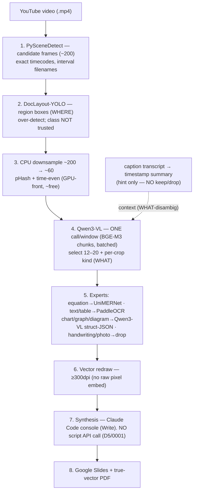

# ADR 0002 — Pipeline v3: CPU downsample + caption-context VLM routing

> **🔀 Scope pivot (2026-06-15): single-video → deck is now an intermediate.** The
> project's output unit moved to **mandala (video-collection) → one deck**. This
> doc records the v1 single-video design, retained for history/reuse (per-video CV
> stages still apply). Consolidated archive:
> [`docs/archive/v1-single-video-per-deck.md`](../archive/v1-single-video-per-deck.md).

> ⚠️ **Amended by [ADR 0003 — Single-video MVP](./0003-mvp-pptx-output-and-prod-llm-extraction.md) (2026-06-10).**
> The CV stages below (D1–D6, D8, D9) remain the accepted design. What §4 of this
> ADR carried forward from 0001 is revised by 0003: **output** (Google Slides +
> vector PDF → `.pptx` via the vendored visual-deck chain), **synthesis/LLM
> boundary** (console-only → prod-path injected slide-LLM inside a deterministic
> harness; dev/test ban unchanged), and the **equation expert** (UniMERNet
> main-path → Qwen3-VL OCR + confidence gate, UniMERNet deferred behind a
> measurement). 0003 also codifies the acquire host (residential-egress proxy),
> the recall-first keyframing invariant, and the `slide_*` caption no-persist rule.

**Status**: Accepted (amended by ADR 0003 — output / synthesis / equation expert / acquire)
**Date**: 2026-06-09
**Supersedes**: [ADR 0001](./0001-pipeline-v1-frame-selection-and-extraction.md) (v1: Katna → Qwen2.5-VL selection → conditional extraction).
**Scope**: v1 design refresh (still **training-free**). LoRA/fine-tuning deferred to v2.
**Diagrams**: `cv_pipeline_v3_caption_context.svg` (overall flow + caption injection), `stage5_routing_v3.svg` (stage-5 expert routing).

---

## 1. Context

ADR 0001 locked a local-VLM-routed v1 pipeline (Katna pre-filter → Qwen2.5-VL
semantic selection → conditional DocLayout-YOLO / UniMERNet → console synthesis →
Google Slides + vector PDF). Since then, scratch-lab CPU verification on two real
lecture videos plus a series of design reviews refined that design materially.
This ADR records the reconciled **v3** design and supersedes 0001's stage list.
The output contract (Google Slides + true-vector PDF), the **LLM-API ban (0001
D5)**, the **vector-300dpi figure gate (0001 D6/D7)**, and the **`slide_*`-only
write rule** are all **carried forward unchanged**.

> ⚠️ **Verification status**: the GPU stages (Qwen3-VL selection/classification,
> diagram struct-JSON) are **not yet implemented** (`figure_extract.py` is a stub).
> The v3 changes below are an accepted *design*; each is gated by a measurement
> (see §6) before it is coded. CPU stages (PySceneDetect, pHash, DocLayout-YOLO,
> UniMERNet, PaddleOCR) are scratch-verified.

---

## 2. Decisions (delta vs ADR 0001)

### D1 — Stage-1 extractor is PySceneDetect (Katna retired)
Katna is CPU-only, 2× decodes + KMeans (slow), front-biases the timeline, crashes
on static video, and encodes a frame **index** (not a timecode) into filenames.
PySceneDetect `ContentDetector` gives **exact decimal timecodes** (no MSE
recovery), a single decode (~4× faster), full timeline coverage, and no
empty-cluster crash. Slide screencasts (fades / pen build-up) need a very low
threshold (`th≈3`). → **PySceneDetect is PRIMARY**; Katna is dropped.

> **Amendment (2026-06-11, shipped in PR #27).** Two implementation specifics now
> live in `frames.py`:
> - **Default `SCENE_DETECT_THRESHOLD = 8`** (was 15). `ContentDetector` measures
>   the *frame-averaged* HSV delta, so the right threshold is **content-type
>   dependent**: lecture-hall camera footage tolerates ~27, but a **white-background
>   screencast** changes only a small text region per slide — its averaged delta is
>   tiny, so a high threshold *misses* slide swaps and collapses many minutes of
>   distinct slides into one scene (measured: a ~23-minute span detected as a single
>   scene). Default LOW (8) and let the downstream pHash + downsample dedup the
>   over-segmentation (recall-first: a missed transition is unrecoverable, an extra
>   near-dup is cheap). Measured on a 53-min screencast: th=8 → 82 scenes / full
>   10/10-decile coverage.
> - **Within-scene multi-sampling** (`_scene_sample_specs`): the wide net takes the
>   scene start **plus duration-proportional mid-scene samples**, not the start
>   only. On lecture-hall recordings cuts track *camera* motion, so the start frame
>   can be the speaker while a figure appears mid-scene — a start-only grab would
>   miss it. The per-scene sample count scales with duration (gap ≤
>   `LONG_SCENE_MAX_GAP_SEC = 20`), so an under-segmented long scene is densely
>   sampled rather than starved at a flat cap. Cost-neutral to the VLM: the pHash
>   merge + downsample absorb the extra candidates.

### D2 — YOLO = WHERE, Qwen = WHAT (YOLO class label is NOT trusted)
DocLayout-YOLO produces precise region boxes (spatial WHERE) with **no coordinate
hallucination**, but its **class label is unreliable** (a 1-line equation looks
like text). Qwen reads content (WHAT) and is the authority on **kind**. Therefore:
- YOLO supplies **boxes only**; the kind is (re)decided by Qwen on each crop.
- **Qwen coordinate output (grounding) is hallucination-prone** → coordinates
  always come from YOLO, never Qwen.
- YOLO runs **low-confidence / over-detect**; Qwen cleans up false boxes. Recall
  (a *missed* box) is the only non-recoverable risk → cross-checked by Qwen's
  per-frame kind tags.

### D3 — CPU downsample stage inserted before the VLM (~200 → ~60)
Feeding ~200 frames straight to the VLM is infeasible (measured T4 OOM + output
length blow-up). A **CPU-only** cut — pHash near-duplicate merge + time-even
downsample — reduces the pool to ~60 *before* GPU. It is near-free on CPU and only
reduces *count*; semantic keep/drop remains the VLM's job (D4). This promotes the
former "v2.1 throughput lever" into the v1 main path.

### D4 — Selection + per-crop classification merged into ONE Qwen3-VL call
0001 split selection (pick 12–20) and routing into separate passes. v3 merges them
into **one call per window** (windows cut on **BGE-M3** topic boundaries), batched.
This halves model load/unload overhead and call count.
- **Frame selection authority is visual only** (PySceneDetect + pHash + YOLO).
- **VLM family**: standardized to **Qwen3-VL** (supersedes 0001's Qwen2.5-VL).

### D5 — Caption summary injected as VLM context (WHAT-disambiguation only)
Keyword (WHAT) misclassification stems from appearance-only judgment. The
transcript for a crop's time interval gives the VLM the **speaker's words** to
settle the kind ("this interval explains an integral"). The caption track is
summarized on a timestamp basis and used in **two roles**:
1. **Selection** — a *priority-score hint* only (which interval is content-heavy).
2. **Per-crop classification** — the crop's `[t_start, t_end]` caption is attached
   as companion text so the VLM disambiguates kind.

> **Hard boundary**: captions have **NO keep/drop authority**. A caption marks
> *when something was said*, not *when the slide changed*; only the visual stages
> select frames. This preserves the boundary established in the working-design
> decision log (caption = hint, never gate).

### D6 — Time-provenance carried through every stage as an interval
Frames shrink across stages (~200 → ~60 → 12–20); without an explicit time range
a surviving crop loses *when* it occurred, so experts cannot align captions or
track slide time. Each artifact carries its **interval `[start, end]`**, not just a
capture instant:
- **Filename** (human): `keyframe_{idx}_[MMmSSs-MMmSSs].jpeg` (`:` is illegal on
  Windows → `MMmSSs`; `~` → `-`).
- **JSON fields** (machine): `t_start` / `t_end` (seconds) on every box.
- **pHash merge** expands the kept frame's interval to span the whole merged group
  `[min start, max end]` so the represented range is never lost.
- This `[t_start, t_end]` is exactly what slices the per-crop caption for D5.

### D7 — Stage-5 routing: charts/graphs/diagrams → Qwen3-VL struct-JSON
All structural visuals (chart, graph, diagram) route to **Qwen3-VL → structure
JSON** (one path), replacing 0001's PaddleOCR numeric extraction for charts.
Unchanged: **equation → UniMERNet (LaTeX)**, **text / table → PaddleOCR**
(language-routed via `SLIDEGEN_OCR_LANG`), **handwriting / photo → drop**
(unredrawable; meaning-caption only, per the copyright gate). See
`stage5_routing_v3.svg`.

### D8 — No YOLO fine-tuning in v1; extra detectors rejected (tentative)
- **Fine-tuning** improves class accuracy, but kind is Qwen's job and ambiguous
  cases (appearance-identical) survive training; v1 stays **training-free**.
- **Inserting another detector** (Grounding DINO / OWLv2 / SAM) between YOLO and
  Qwen is **rejected**: all are appearance-based (SAM has *no* class at all) and
  share YOLO's blind spot — they cannot cross the WHAT ceiling, only a
  content-reading VLM can. Their only use is WHERE-augmentation (missed-box
  recall), which is a different problem.
- This rejection is **tentative** until the caption A/B measurement (§6).

### D9 — Infra: prod = GPU A100 via RunPod (revises 0001 D9)
0001 D9 assumed local-first Apple-Silicon MLX. The prod plan is now **A100 on
RunPod (cloud)**: full bf16 (~15GB) fits, no quantization, `flash_attention_2`.
The whole pipeline is an **async job queue** (`slide_jobs`) — a *throughput*
problem, not latency — so concurrency is absorbed by queue + batch, with the large
VLM resident and run sequentially (MIG splitting is unsuitable). The Mac Mini CV
service remains the dev/test local-first path.

---

## 3. Reconciled v3 pipeline

> **Correction — implementation order (owner decision, 2026-06-11; revised 2026-06-11)**: the diagram above **and** the earlier correction (which put a single pHash + time-even downsample *before* YOLO, with YOLO detecting on only the ~60 cut frames) are **SUPERSEDED**. The validated implemented order is:
>
> **PySceneDetect → pHash (adjacent near-duplicate merge) → DocLayout-YOLO → CPU pre-select → Qwen3-VL.**
>
> The "CPU downsample" (D3) is **split into two passes *around* YOLO**, not a single pre-YOLO cut:
> - **pHash near-duplicate merge (PRE-YOLO)** — collapses only *adjacent* held-frame repeats (~1000 → ~400). Cheap and content-blind; its only job is to keep YOLO off obvious duplicates. Coverage completeness is preserved: the merge keeps one representative per visual group with interval provenance (D6).
> - **CPU pre-select (POST-YOLO)** — the real budget cut. It *consumes YOLO's boxes as signals*: a kind-weighted content score, a **talking-head gate** (no high-confidence figure AND no substantial text → drop a lecturer that YOLO mislabels as a low-confidence `figure`), an orthogonal **COCO person-detector** gate, a **global (non-adjacent) pHash** dedup, and a **coverage-budget** trim to the `TARGET_FRAMES` ceiling.
>
> **Why YOLO runs *before* the budget cut (not on a pre-cut ~60):** the smart cut *needs* YOLO's region boxes to tell a real slide from a lecturer/blank. A pre-YOLO pHash + time-even cut to ~60 is content-blind and would drop genuine slides (e.g. a large but low-confidence diagram) while keeping talking-heads. The trade is **more YOLO calls (~400 vs ~60, ≈250 s on CPU) for a content-aware cut** — validated on real lecture-hall and screencast videos. (Running YOLO on a pre-cut ~60 stays a possible *future* GPU-cost optimization, **not** the current design.)
>
> **Status:** this pre-select stage and its YOLO-signal gates are **validated in the scratch pipeline (`ts_preselect/preselect.py`, orchestrated by `ts_pipeline/run_pipeline.py`) and NOT yet in the repo**. Repo `frames.py` currently performs scene-detect + pHash/time-even downsample only; the pre-select stage + gates are a **carried repo-port work item**. This note records the target order so the ADR matches the validated design until the port lands. The `tests/test_frames.py` decile-coverage guard still applies to the pre-YOLO pHash merge (no decile dropped on the way into YOLO).

| # | Stage | Tech | Module (repo, to port) |
|---|-------|------|------------------------|
| 1 | Extract | **PySceneDetect** | `frames.py` (promote; Katna→drop) |
| 2 | Region boxes (WHERE) | **DocLayout-YOLO** | `figure_extract.py` |
| 3 | CPU downsample ~200→~60 | pHash + time-even | `frames.py` / new helper |
| 4 | Select + classify (WHAT) | **Qwen3-VL** (1 call/window) | `typing_select.py` (rewrite) |
| (ctx) | Caption summary (hint) | BGE-M3 chunks + transcript | `captions.py` |
| 5 | Experts | UniMERNet / PaddleOCR / Qwen3-VL / drop | `figure_extract.py` (multi-region) |
| 6 | Vector redraw | matplotlib / LaTeX / SVG | `redraw.py` |
| 7 | Synthesis | Claude Code console (Write) | `src/plan/*` + slidegen skill |
| 8 | Output | Google Slides + vector PDF | `py/slides_build/`, `src/` |

---

## 4. Carried forward unchanged from ADR 0001

- **D5 (0001)** LLM-API ban — synthesis stays in the Claude Code console (Write).
- **D6/D7 (0001)** vector-300dpi figure gate; Google Slides + true-vector PDF output.
- **D3 (0001)** BGE-M3 caption topic signal retained (now also windows the VLM, D4).
- `slide_*`-only writes; Insighta tables READ-ONLY.

---

## 5. Data model impact

No new columns required beyond ADR 0001's `slide_keyframes` routing fields
(`contains_graph/contains_equation/frame_type/summary_hint/selection_score`) and
`slide_figures.extracted_latex/bbox`. v3 additionally relies on a per-box
**time interval** (`t_start`/`t_end`); persist it within the existing
`slide_figures.bbox jsonb` (no schema change). Any future dedicated columns ship
as **raw SQL DDL** (no `prisma db push`), local → prod, with `\d` verify +
`NOTIFY pgrst` reload + consumer grep.

---

## 6. Measurement gates (decide before coding/fine-tune/extra-detector)

All v3 GPU claims are **unverified hypotheses** (`figure_extract.py` =
NotImplementedError). Gate order:

1. **Caption A/B correction-rate (top priority)** — misclassified crops → Qwen3-VL
   *with vs without* the interval caption. This single number gates (a) the caption
   value, (b) any YOLO fine-tuning need, (c) any extra-detector decision (D8).
2. **Post-downsample 1-call profile** — ~60-frame input load/inference time + VRAM;
   decides batch size (60-at-once vs micro-batch 10–15).
3. **D8 detector rejection stays tentative** until gate 1.

---

## 7. Repo port backlog (this ADR is doc-only; code unchanged)

- `frames.py`: PySceneDetect → PRIMARY + count-control downsample + post-download
  duration-validation gate + interval filenames.
- `figure_extract.py`: multi-region routing (currently NotImplementedError).
- `typing_select.py`: Qwen3-VL router (select + classify, caption context) +
  `_persist_keyframes()`.
- `redraw.py`: native vector redraw.
- `requirements.txt`: Qwen3-VL / mlx-vlm; keep doclayout-yolo, unimernet, paddleocr.

---

## 8. Rejected (with reason)

| Proposed | Rejected because |
|----------|------------------|
| Trust YOLO class label | YOLO = WHERE only; kind is Qwen's (D2) |
| Extra detector (Grounding DINO/OWLv2/SAM) before Qwen | appearance-based, same blind spot; SAM has no class (D8, tentative) |
| YOLO fine-tuning in v1 | training-free v1; kind is Qwen's (D8) |
| Captions decide keep/drop | caption = WHEN-spoken ≠ slide change; hint only (D5) |
| PaddleOCR numeric chart extraction | charts/graphs/diagrams unified to Qwen3-VL struct-JSON (D7) |
| OpenRouter / scripted LLM API | LLM-API ban (carried 0001 D5) |
