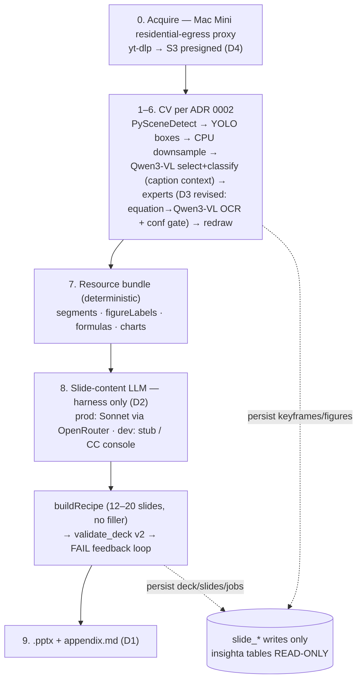

# ADR 0003 — Single-video MVP: .pptx output, prod-path LLM extraction, acquire proxy

**Status**: Accepted
**Date**: 2026-06-10
**Amends**: [ADR 0002 — Pipeline v3](./0002-pipeline-v3-cpu-downsample-caption-context.md).
The CV stages (0002 D1–D6, D8, D9) are **carried forward unchanged**. This ADR
revises what 0002 carried forward from ADR 0001 §4: the **output contract**, the
**synthesis/LLM boundary**, and the **equation expert**, and codifies the
**acquire host**, the **recall-first keyframing invariant**, the **caption
no-persist rule for `slide_*`**, and the **asset-vendoring plan**.
**Scope**: single-video card → one typed deck (card-level v1, "A baseline").
Collection/mandala-level generation, DocLayout-YOLO fine-tuning, and VLM LoRA
are explicitly out of scope ("B" — only after measured A-quality gaps).

---

## 1. Context

The team-confirmed MVP plan (2026-06-10, architect-decided) and the now-live
infra changed three assumptions that ADR 0002 had carried forward from 0001:

1. **Infra is deployed**: a cloud GPU host (RunPod) serves **Qwen3-VL-8B** and
   **DocLayout-YOLO** (base weights, zero-shot); the application/orchestration
   layer runs on the Insighta backend host; artifacts move between hosts via
   **S3 presigned URLs + HTTP** in an async-job pattern. This matches 0002 D9.
2. **A validated deck-building asset exists**: the `insighta-visual-deck`
   package — pptxgenjs template/recipe chain (8 deck types), `figures.py`
   (matplotlib teaching graphs), `validate_deck.py` v2 (structure / density /
   filler-slide / overflow / meta-text checks), `orchestrate.js`
   (build → validate → FAIL-feedback self-correction loop, demonstrated
   FAIL→PASS), and `extract_resources.js` (resource-bundle assembly). Rebuilding
   this from scratch for a different output format would discard verified work.
3. **The slide-content LLM is part of the production service**: content
   extraction (resource bundle → content JSON) runs on **Claude Sonnet via
   OpenRouter** in the deployed pipeline. The inherited LLM-API rule already
   scopes these APIs as "production-service only"; what was missing was an
   explicit boundary statement for this repo (see D2).

Three design invariants from the confirmed plan (recorded here so they are not
re-litigated):

- **P1 — No agentic tool-calling by the 8B VLM.** Deterministic code invokes
  YOLO/OCR/extractors; the VLM only answers content questions.
- **P2 — A snapshot is a data source, never the artifact.** Final figures are
  **regenerated** from extracted data (struct-JSON, LaTeX, OCR text); raw frame
  pixels are never pasted into the deck as the final figure.
- **P3 — The harness is the quality lever.** Extract → build → validate →
  feedback makes a mid-tier model converge to the same PASS bar; model strength
  is not the plan.

---

## 2. Decisions

### D1 — Output = `.pptx` via the vendored visual-deck chain (revises 0001 D7 as carried by 0002 §4)

The MVP output is a **.pptx deck** built by the vendored `insighta-visual-deck`
chain (fixed template code + content-object injection), plus a Markdown
appendix. Google Slides + true-vector PDF become a **deferred additive track**
(`py/slides_build/` stubs are retained, not deleted).

- 0001 D7 rejected python-pptx output because the proposal `exec()`ed
  LLM-generated code. The vendored chain has **no code generation**: layout code
  is fixed and tested; the model supplies only content objects. The security
  objection does not apply.
- The Google Slides path has 0% implementation (all `py/slides_build` modules
  are stubs) and no automated validator; the pptx path ships with a working
  validator and self-correction loop. Effort delta is decisive for an MVP.
- **Figure quality gate restated for pptx** (0001 D6 / 0002 carried, upheld):
  structures (tables/trees/flows/matrices) as **native editable objects**
  (vector); data graphs as **matplotlib PNG ≥ 300 dpi**; equations as
  **text/LaTeX-derived rendering** — never a pasted raw frame (P2).

### D2 — LLM boundary: prod service path may call the slide-LLM inside the harness; dev/test ban unchanged (revises 0001 D5 as carried by 0002 §4)

The inherited parent rule scopes Anthropic/OpenRouter APIs as
**production-service only**. This ADR states the boundary for this repo:

- **Prod service path**: the deployed pipeline calls the slide-content LLM
  (**Claude Sonnet via OpenRouter**) **only inside the deterministic harness**:
  `extract(bundle) → content JSON → buildRecipe → validate_deck → FAIL feedback
  → retry until PASS`. No agentic tool use (P1); the LLM never controls
  extraction tools or writes code.
- **Dev / test / CI / dataset generation**: LLM API calls remain **banned, no
  exceptions**. The LLM is **injected** (a function parameter, as designed in
  the visual-deck chain), so dev/test inject stubs or Claude-Code-console-
  authored content-JSON fixtures (Write tool), and CI never holds a key.
- `OPENROUTER_API_KEY` is a **prod-only** config key, exactly like
  `VISION_API_PROVIDER` / `GEMINI_API_KEY`: it must never appear in a dev/test
  `.env`, and the config module must refuse it when `SLIDEGEN_MODE=dev`.

### D3 — Equation expert: Qwen3-VL OCR + confidence gate for MVP; UniMERNet deferred behind a measurement (revises 0002 D7 equation row)

- MVP routes `equation` crops to **Qwen3-VL OCR → LaTeX** with a known
  precision limitation on complex formulae.
- Every equation figure carries `extraction_conf`; low-confidence figures are
  **flagged** (`verification_status='unverified'`, visibly marked in the deck),
  never silently embedded.
- **UniMERNet** is added on the GPU host **only after a measured quality gap**
  on the target video set (same measurement-gate pattern as 0002 §6). The
  0001 D4-B comparison stands: the specialized-model choice is UniMERNet, not
  Pix2Text/pix2tex.
- Chart/graph/diagram → Qwen3-VL struct-JSON and text/table → PaddleOCR routing
  (0002 D7) are unchanged.

### D4 — Acquire host: residential-egress download proxy; datacenter-IP video download is prohibited

Video download (yt-dlp) from datacenter IPs (cloud app host, GPU host) is
**prohibited** — an inherited hard rule grounded in bot-detection blocking.
Acquisition runs on the **Mac Mini host (residential egress)** and hands frames
or crops to the rest of the pipeline via S3 presigned URLs. The Mac Mini's role
is therefore twofold:

1. **Acquire proxy** (download + stage-1 frame extraction input) — prod and dev.
2. **Dev/test local model path** (0002 D9 unchanged) — a thin local serving of
   the same model API surface, so dev and prod differ only by endpoint URL.

### D5 — Recall-first keyframing invariant

Stage-1 extraction **over-extracts by design**: a missed keyframe is
unrecoverable downstream, while duplicates are cheap to remove (pHash merge,
0002 D3). This is the principle already implicit in 0002 D2 (YOLO over-detect)
and D3 (downsample *after* the wide net) — recorded here as an invariant with a
PR-level acceptance criterion: **full-timeline coverage and zero missed slide
transitions on the test video set are verified before dedup tightness is
tuned**. Recall failures block; precision failures do not.

### D6 — Caption no-persist inside `slide_*`

Raw caption/transcript text must **never be persisted in `slide_*` tables**.
The scaffolded `slide_caption_segments.text` column violates this and will be
**dropped** (raw SQL DDL in a dedicated PR): the table keeps embeddings,
topic-boundary flags, and time ranges only. Runtime caption-context use
(0002 D5 — interval captions attached to VLM calls) is unaffected: in-memory
only, never written.

### D7 — Asset vendoring: `insighta-visual-deck` → this repo

The validated package is vendored, not rewritten:

| Asset | Destination | Rule |
|---|---|---|
| JS chain (`insighta_deck` / `slide_templates` / `deck_templates` / `deck_recipes` / `router` / `orchestrate` / `extract_resources`) | `deck/` — self-contained CommonJS Node package, invoked by the orchestrator | **No TS rewrite** (verified layout code stays byte-stable); thin zod-typed adapter on the `src/` side |
| `figures.py`, `validate_deck.py` | `py/` | As-is + smoke tests; `validate_deck.py` is stdlib-only |
| Fonts (Pretendard, JetBrains Mono — both SIL OFL) + brand/reference docs | `deck/assets/`, `deck/references/` | OFL license files committed alongside |

The **validate loop is a required pipeline stage**, not advisory: a deck that
has not passed `validate_deck.py` does not leave the pipeline.

---

## 3. MVP pipeline (stages 1–6 per ADR 0002; 7–9 per this ADR)

Async-job pattern: every stage transition is tracked in `slide_jobs`
(queue/retry/timeout/partial-recovery columns ship as raw SQL DDL in a
dedicated PR).

---

## 4. Cross-layer impact

| Layer | Change |
|---|---|
| `deck/` (new) | vendored JS chain (D7) |
| `py/` | + `figures.py`, `validate_deck.py`; `py/slides_build/` retained as deferred-track stubs (D1) |
| `src/types/slide-manifest.ts` | **v2 mirror is wrong vs the real v2 shape** (`segments` is an object `{sections[], atoms[]}`; `core` has no `title`/`qa_pairs`) — must be rewritten from the parent v2 type source before any consumer work |
| `src/config` | + `OPENROUTER_API_KEY` (prod-only, mode-gated), GPU-host endpoint URLs (injected, dev/prod differ by URL only) |
| `mac-mini/slidegen-service` | acquire-proxy role formalized; model serving narrows to a thin local endpoint mirroring the prod API (D4) |
| `prisma` | drop `slide_caption_segments.text`; `slide_jobs` stage enum + retry/timeout columns — raw SQL DDL, local→prod, `\d` verify, `NOTIFY pgrst`, consumer grep |
| Output | `.pptx` + appendix; `google_slides_*`/`vector_pdf_url` columns retained for the deferred track |

---

## 5. Phasing (each PR in its own worktree, with verification)

1. ~~PR-A — this ADR + doc sync~~ (this change).
2. **PR-B** — v2 mirror rewrite + `fetchV2` + fixture tests (blocker for all consumers).
3. **PR-C** — vendor `insighta-visual-deck` (D7) + fixture-content build → `validate_deck.py` PASS smoke.
4. **PR-D** — `frames.py` port per 0002 §7 (PySceneDetect primary) with the **recall-first acceptance criterion (D5)**.
5. **PR-E** — model-endpoint clients (Qwen3-VL / DocLayout-YOLO, URL-injected; extend `vlm_router.py` backends with an HTTP backend; Qwen3-VL default).
6. **PR-F** — bundle assembly + orchestrate loop port (LLM injected; stub-driven E2E FAIL→PASS in dev).
7. **PR-G** — raw SQL DDL (D6 + `slide_jobs` columns).
8. **PR-H** — dev-path E2E on one real video (CC console as the LLM) → deck artifact + validate PASS.

---

## 6. Rejected (with reason)

| Proposed | Rejected because |
|---|---|
| Google Slides + vector PDF as MVP output | 0% built, no validator; pptx chain is validated end-to-end (D1) |
| yt-dlp from the cloud app/GPU host | datacenter-IP bot blocking; inherited hard rule (D4) |
| Deploy Pix2Text for equations | 0001 D4-B already selected UniMERNet over pix2tex; and MVP defers the specialized model entirely behind a measurement (D3) |
| Raw frame crop pasted as final figure | P2 / vector-300dpi gate (D1) |
| LLM API calls in dev/test/CI | inherited ban, unchanged (D2) |
| Agentic tool-calling by the VLM | P1 — extractors are invoked by deterministic code |
| Rewrite visual-deck chain in TypeScript | discards verified layout code; vendor + thin adapter instead (D7) |

---

## 7. Reviewer note

This ADR encodes the architect's 2026-06-10 confirmed decisions (team-shared).
Where it conflicts with what ADR 0002 §4 carried forward (output contract,
console-only synthesis, equation expert), **this ADR prevails**; 0002's CV-stage
design (D1–D6, D8, D9) is untouched and remains the reference for stages 1–6.
