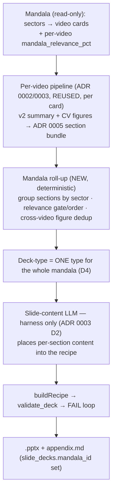

# ADR 0006 — Mandala → one deck (output-unit pivot)

**Status**: Proposed (design direction only — no code/schema change in this ADR)
**Date**: 2026-06-15
**Pivots**: the output unit fixed by [ADR 0003](./0003-mvp-pptx-output-and-prod-llm-extraction.md)
§ scope (single video card → one deck). The single-video design is archived at
[`docs/archive/v1-single-video-per-deck.md`](../archive/v1-single-video-per-deck.md).
**Builds on**: [ADR 0005](./0005-resource-bundle-section-grouping.md) (section-grouped
resource bundle) — the per-section grouping is the per-video unit a mandala deck
aggregates over.

> **What changes, what does not.** The pivot is at the **output/aggregation
> level only**. Every per-video CV stage (ADR 0002 D1–D9: extract → YOLO boxes →
> downsample → Qwen3-VL select+classify → experts → figure regeneration) and the
> deterministic deck harness (ADR 0003 P1/P2/P3, the vendored `deck/` chain,
> `validate_deck` FAIL loop) are **carried forward unchanged**. What moves is the
> unit that maps to one `.pptx`: a **mandala**, not a single card.

---

## 1. Context

Insighta organizes saved videos in a **mandala** — a user's learning grid. The
hierarchy (owner-confirmed 2026-06-15):

```
mandala  →  sector (= mandala "cell")  →  video card (one YouTube video)
```

Each video card already carries a generated **v2 rich-summary**
(`video_rich_summaries`) with timestamped sections, atoms, and — crucially for
aggregation — a **mandala alignment** signal that is *already in this repo*:

- `slide_decks.mandala_id uuid` (+ index) — the deck↔mandala link is already
  scaffolded (`prisma/schema.prisma`).
- `video_rich_summaries.mandala_relevance_pct int` — per-video relevance to the
  mandala.
- `analysis.mandala_fit` (typed in `src/types/slide-manifest.ts`, fixture
  `src/types/v2-summary.fixture.ts`): `{ suggested_goals[], relevance_rationale,
  mandala_relevance_pct }` — *why* and *how much* a video fits the mandala.

The mandala→deck behavior was **already sketched as the deferred v2 scenario**
(PRD §2.3 "Scenario C", §13 roadmap): aggregate section-level content across the
cards in a mandala cell, dedupe overlapping concepts via embedding similarity,
produce a multi-video narrative deck, with a shared figure library across cards.
This ADR **promotes that deferred scenario to the primary output unit.**

### What this repo does NOT own (read-only upstream input)
The **sector/cell membership** (which video belongs to which sector, and the
sector ordering) is an **Insighta-core concept**, not a `slide_*` concern. This
public repo treats it as a **read-only input**: slidegen consumes `mandala_id`
and each video's `mandala_relevance_pct` / `mandala_fit`; it never defines or
writes the mandala/sector structure (Insighta tables remain READ-ONLY; writes go
only to `slide_*`).

---

## 2. Decisions (owner-confirmed 2026-06-15)

### D1 — Aggregation unit = the whole mandala → one deck
One **mandala** (all its sectors, all their video cards) maps to **one `.pptx`
deck**. The deck is linked via the existing `slide_decks.mandala_id`. (Single
video → deck remains available as the per-video building block, but is no longer
the delivered artifact.)

### D2 — The deck mirrors the mandala's sector structure
The mandala's **sectors** are the deck's top-level grouping (each sector → a
section/chapter group of slides). Within a sector, content comes from the member
videos' **existing v2 rich-summaries** (timestamped sections + atoms) — **not raw
captions** (ADR 0003 D6 caption no-persist; the bundle already carries refined
summaries, not transcript). The single-video pipeline is reused per card; its
ADR 0005 `sections[]` output is the per-video unit that rolls up into a sector.

### D3 — `mandala_relevance_pct` drives inclusion / ordering / emphasis
The per-video relevance signal (already in `video_rich_summaries`) governs how
much space and prominence each card gets:
- High relevance → fuller treatment / earlier placement.
- **`mandala_relevance_pct < 30` → trimmed or carried as a low-alignment note**
  (consistent with the existing PRD §4 rule and the slidegen skill's
  `blank("low_relevance")` behavior).

### D4 — One single deck type for the whole deck
The whole mandala deck uses **one deck type** (from the 8 `router.js` types), not
a per-video mix. How the single type is chosen (e.g. relevance-weighted vote
across the member videos, or a mandala-topic-level classification, or a new
"curriculum/overview" type) is **deferred to §4 open questions** — but the
*decision that it is one type* is fixed here.

### D5 — Carry-forward unchanged
Per-video CV pipeline (ADR 0002), figure regeneration + vector-300dpi gate, the
LLM-harness boundary + bulk-API ban (ADR 0003 D2), `slide_*`-only writes, and the
`validate_deck` FAIL loop all apply unchanged. The deck-content LLM still only
*places* content into a fixed recipe; it does not aggregate agentically.

---

## 3. Pipeline shape (per-video reuse → mandala roll-up)



The **NEW** work is the deterministic **mandala roll-up** stage (group by sector,
apply the relevance gate/ordering, cross-video figure dedup) and the
single-type selection — everything else is reuse.

---

## 4. Open questions (deferred — decision/measurement-gated)

Recorded so the boundary is explicit; **not decided here**:

1. **Single deck-type selection rule** (D4): relevance-weighted majority vote over
   member videos vs a mandala-topic classification vs a new "curriculum/overview"
   9th type in `router.js`.
2. **Slide-budget allocation**: is the deck a fixed 12–20 slides for the whole
   mandala, or a per-sector budget (e.g. N slides/sector scaled by relevance)? A
   large mandala will exceed a single 12–20 envelope.
3. **Cross-video figure dedup / shared figure library** (PRD §13): how overlapping
   figures across cards in a sector are deduped (embedding similarity threshold —
   measurement-gated, per the inherited measurement-before-tuning rule).
4. **Bundle extension**: how ADR 0005's additive `sections[]` view extends to a
   **multi-video, sector-grouped** bundle (a `sectors[] → videos[] → sections[]`
   nesting, or a flattened sector view with `video_ref`).
5. **Sector / video ordering** within the deck, and the `mandala_relevance_pct`
   thresholds for include / trim / note (the `< 30` note rule is the only fixed
   point so far).
6. **Empty/low-content sectors**: orphan handling (recall-first, mirroring
   ADR 0005 D3) at the sector granularity.

These land in a follow-up implementation ADR + PR, each with its own
verification; this ADR is **doc-only** (no code/schema change).

---

## 5. Cross-layer impact (forward note — not applied here)

| Layer | Anticipated change (future PR) |
|---|---|
| `src/` orchestrator | new mandala entry: resolve `mandala_id` → member videos → run per-video pipeline → roll-up |
| `bundle.py` / a new roll-up module | sector-grouped multi-video bundle (extends ADR 0005 `sections[]`) |
| `deck/` chain | single-type selection across videos; per-sector grouping into the recipe (no vendored-chain rewrite — adapter side) |
| `prisma` | `slide_decks.mandala_id` already exists; any sector/relevance columns ship as raw SQL DDL if needed (local→prod, `\d` verify, `NOTIFY pgrst`) |
| Insighta tables | READ-ONLY — mandala/sector membership consumed, never written |

---

## 6. Rejected / not chosen (with reason)

| Proposed | Not chosen because |
|---|---|
| Per-video deck type mix | owner chose one single type for the whole deck (D4) |
| Aggregate one sector/cell only as the unit | owner chose the **whole mandala** as the unit (D1); sectors are the internal grouping |
| Build from raw captions for cross-video context | ADR 0003 D6 caption no-persist; the v2 summaries are already the refined input (D2) |
| Define sector/cell structure in `slide_*` | sector membership is an Insighta-core (read-only) concept; slidegen consumes it (§1) |
| Decide figure dedup / slide budget now | unmeasured tuning; deferred to §4 (measurement-before-tuning) |
