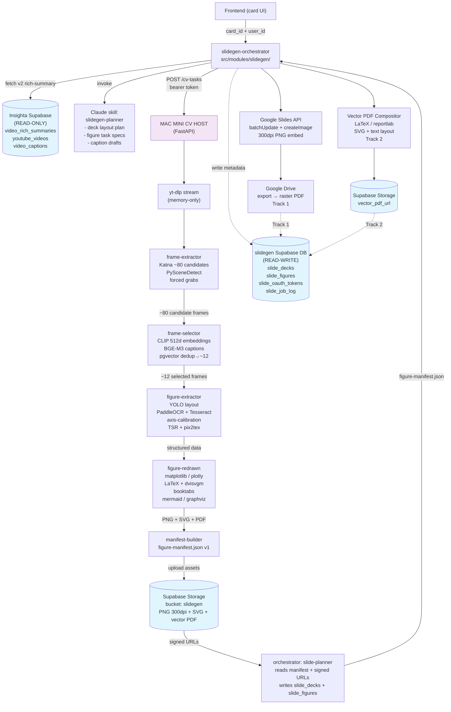
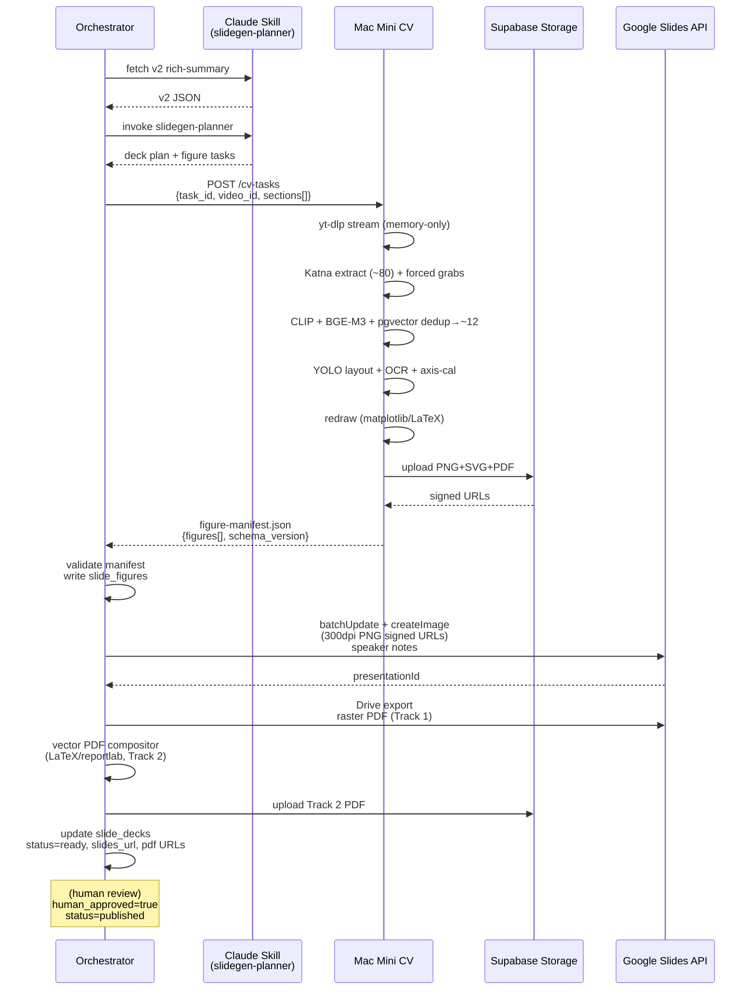

# Slidegen Architecture

**Version**: 0.1
**Status**: Design
**Companion docs**: `docs/PRD.md` (full spec), `docs/CONTRACT_figure-manifest.md` (CV<->planner contract)

---

## Table of Contents

1. [Component Diagram](#1-component-diagram)
2. [Run-Location Reference](#2-run-location-reference)
3. [slide_* Table Definitions](#3-slide_-table-definitions)
4. [CV to Slidegen Figure Contract Summary](#4-cv-to-slidegen-figure-contract-summary)
5. [Single Deck Build — Sequence Diagram](#5-single-deck-build--sequence-diagram)

---

## 1. Component Diagram

> **DRAFT — superseded by [ADR 0001](../adr/0001-pipeline-v1-frame-selection-and-extraction.md).**
> The CLIP + BGE-M3 + pgvector-dedup hypothesis below is replaced for v1 by a
> local VLM router (Qwen2.5-VL) + conditional DocLayout-YOLO / UniMERNet
> extraction (synthesis stays in the Claude Code console; Google Slides + vector
> PDF output unchanged). The diagram below is retained for historical context;
> see ADR 0001 for the accepted v1 design. (Original DRAFT ref: PRD §5.2.)



---

## 2. Run-Location Reference

| Component | Host | Language / Runtime | Network |
|---|---|---|---|
| slidegen-orchestrator | Insighta prod server | TypeScript / Node.js 20 | Internal |
| Claude skill (slidegen-planner) | Insighta prod server | Invoked via prod service path | Internal |
| Insighta DB reads | Insighta prod server | Supabase JS client, READ-ONLY | Supabase cloud |
| Mac Mini CV service | Mac Mini CV host | Python 3.11 / FastAPI | Tailscale VPN; env: `CV_HOST_BASE_URL` |
| yt-dlp stream | Mac Mini CV host | Python subprocess | Internet |
| Katna frame extraction | Mac Mini CV host | PyTorch MPS | Local |
| CLIP image embeddings | Mac Mini CV host | PyTorch MPS | Local |
| BGE-M3 caption embeddings | Mac Mini CV host | PyTorch MPS | Local |
| pgvector cosine dedup (frame selection) | Mac Mini CV host | pgvector extension | Local |
| YOLO layout detection (post-selection) | Mac Mini CV host | PyTorch MPS | Local |
| OCR (PaddleOCR + Tesseract) | Mac Mini CV host | Python | Local |
| pix2tex | Mac Mini CV host | Python | Local |
| matplotlib / LaTeX redraws | Mac Mini CV host | Python | Local |
| Vision API fallback | Prod service path only | Gemini Vision API | External; gated by `SLIDEGEN_ENV=prod` |
| Asset upload | Mac Mini CV host | httpx to Supabase Storage | Supabase cloud |
| Google Slides assembly | Insighta prod server | Google Slides API client | Google APIs |
| Vector PDF compositor | Insighta prod server or Mac Mini (TBD) | Python (LaTeX / reportlab) | Local |
| slidegen DB writes | Insighta prod server | Supabase JS client or raw SQL | Supabase cloud |

**Mac Mini CV host address**: configure via environment variable `CV_HOST_BASE_URL`. The Tailscale address is available in `memory/credentials.md` (not stored in this public repo).

---

## 3. slide_* Table Definitions

All tables are created via raw SQL DDL. The canonical DDL source is `prisma/migrations/slidegen/001_initial.sql`.

### slide_decks

```
Column              Type        Notes
────────────────────────────────────────────────────────────────────
id                  UUID        PK
video_id            VARCHAR(11) YouTube video ID (11-char)
generator_version   VARCHAR(32) e.g. "v1.0.0" — composite UNIQUE key with video_id
status              VARCHAR(32) pending | building | ready | published | failed
human_approved      BOOLEAN     Must be TRUE before status -> published
slides_url          TEXT        Google Slides presentation URL
raster_pdf_url      TEXT        Supabase Storage signed URL (Track 1)
vector_pdf_url      TEXT        Supabase Storage signed URL (Track 2)
figure_count        INTEGER
verified_count      INTEGER
unverified_count    INTEGER
dropped_count       INTEGER
created_at          TIMESTAMPTZ
updated_at          TIMESTAMPTZ
```

UNIQUE constraint: `(video_id, generator_version)`.

### slide_figures

```
Column                  Type        Notes
─────────────────────────────────────────────────────────────────────────
id                      UUID        PK
deck_id                 UUID        FK -> slide_decks(id) CASCADE DELETE
figure_id               VARCHAR(128) Stable ID: "{video_id}_{section_idx}_{frame_type}_{seq}"
kind                    VARCHAR(32)  redrawn | keyframe
frame_type              VARCHAR(32)  figure_chart | figure_table | figure_formula | ...
timestamp_sec           FLOAT        Source frame timestamp in video
extraction_confidence   FLOAT        0.0 – 1.0
verification_status     VARCHAR(32)  verified | unverified | dropped
png_300dpi_url          TEXT         Supabase Storage URL
vector_pdf_url          TEXT         Supabase Storage URL (null if keyframe)
vector_svg_url          TEXT         Supabase Storage URL (null if keyframe)
caption                 TEXT
source_atom_refs        JSONB        Array of atom identifiers from v2
created_at              TIMESTAMPTZ
```

### slide_oauth_tokens

```
Column          Type        Notes
────────────────────────────────────────────────────────────────────
user_id         UUID        PK; references Insighta auth.users
encrypted_token TEXT        AES-256-GCM encrypted refresh token
scope           TEXT        Space-separated Google OAuth scopes
expires_at      TIMESTAMPTZ NULL for non-expiring (verified app); 7-day for Testing status
created_at      TIMESTAMPTZ
updated_at      TIMESTAMPTZ
```

### slide_job_log

```
Column          Type        Notes
────────────────────────────────────────────────────────────────────
id              UUID        PK
deck_id         UUID        FK -> slide_decks(id); nullable (pre-deck failure)
video_id        VARCHAR(11) Denormalized for query convenience
stage           VARCHAR(64) e.g. "frame_extraction" | "frame_selection" | "figure_redraw" | "slides_assembly"
status          VARCHAR(32) started | completed | failed
duration_ms     INTEGER
error_detail    JSONB       Structured error; null on success
logged_at       TIMESTAMPTZ
```

---

## 4. CV to Slidegen Figure Contract Summary

Full contract: `docs/CONTRACT_figure-manifest.md`.

The Mac Mini CV host produces a figure manifest JSON document after completing a CV task. The orchestrator on the Insighta prod server consumes this manifest. The contract between them has the following invariants:

1. **Manifest schema version** is declared in `manifest.schema_version` and is validated at consumption time. If the version is unsupported, the orchestrator fails loud.
2. **Every figure entry has a `verification_status`** of exactly `"verified"`, `"unverified"`, or `"dropped"`. The orchestrator never proceeds if this field is absent or null.
3. **`dropped` figures have null asset URLs**. The orchestrator skips them entirely.
4. **`unverified` figures have PNG assets** but null `vector_pdf_url` and `vector_svg_url`. They are embedded in slides with a visible watermark.
5. **`verified` figures have all three asset URLs populated** (PNG, vector PDF, SVG). Missing URLs for `verified` figures cause the orchestrator to reject the manifest for that figure and downgrade to `unverified`.
6. **`source_atom_refs` is never empty** for `redrawn` figures. The orchestrator logs a warning for any redrawn figure missing provenance.

---

## 5. Single Deck Build — Sequence Diagram


